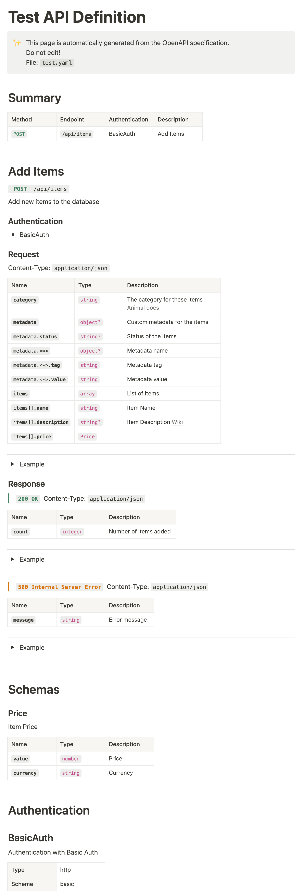

# Notion OpenAPI Converter

Utility to convert OpenAPI definitions into Notion pages using the Notion API.

## Usage
1. **Create a Notion integration** and obtain the secret token.
2. **Share the Target Notion page** with the integration.
3. The Target page must be part of a Notion Wiki (for adding properties).
4. Ensure each OpenAPI definition has a unique title, which will be used as the Notion page title.

## Configuration Options
### Config File
The config file is a YAML file with the following structure:
```yaml
generateCollection: '/path/to/collection.yaml'
pages:
  - notionPageId: aaaaaaaaaaaaaaa
    apiFolder: path/to/docs
  - notionPageId: bbbbbbbbbbbbbbb
    apiFolder: path/to/other
```
- `pages`: list is a list of Target Notion pages and the path to the folder containing the OpenAPI definitions.
- `generateCollection`: is an optional path to a collection file that will be generated with all the input files.

# Run Locally

### Requirements
- Java 11+

### Build
```bash
./gradlew shadowJar
```

### Environment Variables
- `NOTION_TOKEN` : The Notion integration API token

### Run
```bash
export NOTION_TOKEN=secret_ababababababababababba
java -jar build/libs/app.jar --tags=PII,Legal .. 
```

# Test Screenshot

